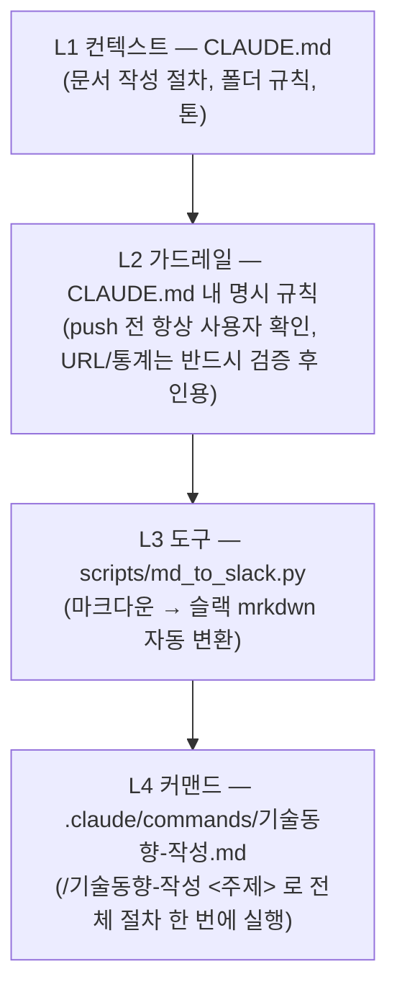

# Tech_Storage

기술 자료 수집 — 관심 있는 기술 주제를 마크다운으로 정리해 축적하고, 공유하기 위한 저장소입니다.

## 구조

```
기술동향/
  AI-에이전트/       # AI 에이전트, 하네스 엔지니어링, 에이전틱 워크플로우
  LLM-모델/          # 모델 출시, 벤치마크, 파인튜닝/추론 기법
  개발도구/           # IDE, CLI, 코드 리뷰/생산성 도구
  클라우드-인프라/     # 클라우드, 컨테이너/오케스트레이션, MLOps
  보안/              # AI 보안, 소프트웨어 보안, 취약점 대응
    README.md        # 각 폴더의 범위 설명 + 목록
    YYYY-MM-DD-주제.md
```

주제 폴더는 필요에 따라 늘어날 수 있습니다. 어느 폴더에도 안 맞는 주제가 생기면 새 폴더를 만들고 이 표를 갱신하세요.

## 작성 규칙

- 파일명: `YYYY-MM-DD-주제-슬러그.md`
- 각 문서는 한 줄 요약 → 핵심 내용 → 참고자료(공식 문서 우선) 순으로 구성
- 표준 GitHub 마크다운(헤더, 표, mermaid 다이어그램, 링크)으로 작성 — 슬랙 공유는 아래 변환 스크립트를 거칠 것
- 문서 맨 끝에 이 저장소 링크를 남김: `📎 더 많은 기술동향: https://github.com/21-Arbiter/Tech_Storage` (슬랙에 내용만 복사해가도 출처로 돌아올 수 있게)
- 새 문서를 추가하면 해당 주제 폴더의 `README.md` 목록에도 링크를 추가

## 슬랙에 공유하기

슬랙은 GitHub 마크다운이 아니라 자체 규격(mrkdwn)을 씁니다. `**굵게**`가 `*굵게*`로 바뀌어야 하고, 표·mermaid 다이어그램은 슬랙 메시지에서 아예 렌더링되지 않습니다. `scripts/md_to_slack.py`가 이 변환을 자동으로 해줍니다.

```bash
python scripts/md_to_slack.py 기술동향/AI-에이전트/2026-07-21-하네스-엔지니어링.md
```

- `**굵게**` → `*굵게*`, `# 제목` → `*제목*`(굵게), `[텍스트](url)` → `<url|텍스트>`
- 표는 `• *항목* → 값1 → 값2` 형태의 불릿 리스트로 변환
- mermaid 다이어그램은 슬랙에 표현할 수 없어 "원본 링크에서 확인" 안내문으로 대체 — 다이어그램이 중요한 문서는 GitHub 링크를 같이 공유
- 결과를 파일로 저장하려면 `--out out.txt` 옵션 추가

## 이 저장소의 하네스 구조

이 저장소 자체가 "하네스 엔지니어링"([관련 글](기술동향/AI-에이전트/2026-07-21-하네스-엔지니어링.md))의 실제 적용 사례입니다. AI에게 매번 규칙을 새로 설명하지 않아도, 아래 레이어들이 세션이 바뀌어도 유지되는 "기억"과 "안전장치" 역할을 합니다.



**그림 읽는 법:** 새 대화 세션이 시작되면 Claude Code가 `CLAUDE.md`(L1)를 자동으로 읽어 이 저장소의 작성 규칙을 기억한 상태로 시작합니다. 그 규칙 안에는 "push 전엔 반드시 확인받는다", "출처는 검증 후 인용한다" 같은 안전장치(L2)가 포함되어 있습니다. 슬랙 공유처럼 반복되는 작업은 스크립트(L3)로 자동화해뒀고, 전체 작성 절차는 커맨드(L4) 하나로 호출할 수 있습니다. 즉 "어떻게 작성해야 하는지"를 사람이 매번 기억하거나 설명하지 않고, 파일 구조 자체가 그 역할을 대신합니다.

## 목차

- [AI-에이전트](기술동향/AI-에이전트/README.md)
  - [2026-07-21 — 하네스 엔지니어링(Harness Engineering)이란 무엇인가](기술동향/AI-에이전트/2026-07-21-하네스-엔지니어링.md)
  - [2026-07-21 — MCP 소개와 업무 자동화 방법론](기술동향/AI-에이전트/2026-07-21-mcp와-업무자동화.md)
  - [2026-07-21 — k-skill 소개 — 한국형 서비스에 특화된 AI 에이전트 스킬 모음](기술동향/AI-에이전트/2026-07-21-k-skill-소개.md)
  - [2026-07-21 — slides-grab 소개 — AI 에이전트가 만드는 HTML 기반 슬라이드](기술동향/AI-에이전트/2026-07-21-slides-grab-소개.md)
- [LLM-모델](기술동향/LLM-모델/README.md)
- [개발도구](기술동향/개발도구/README.md)
- [클라우드-인프라](기술동향/클라우드-인프라/README.md)
- [보안](기술동향/보안/README.md)
