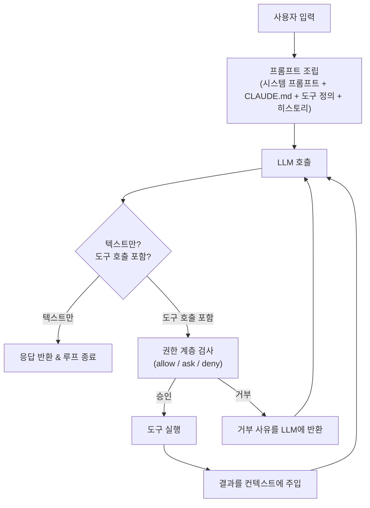
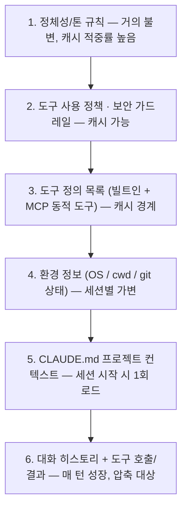
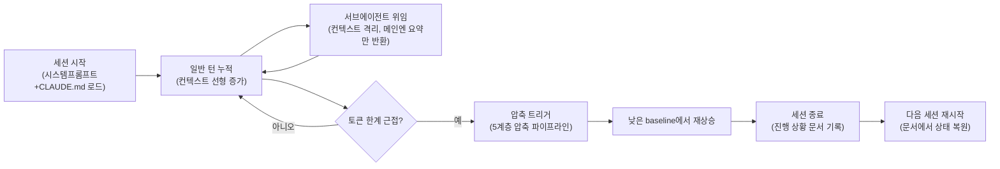

# [기술동향] LLM 에이전트의 "하네스(Harness)" — Claude Code를 중심으로

## 한 줄 요약
프론티어 모델도 잘 설계된 **하네스(harness)** 없이는 여러 컨텍스트 윈도우에 걸친 긴 에이전틱 작업을 안정적으로 수행하지 못한다. 모델이 "지능"을 제공한다면, 하네스는 그 지능을 통제하고 반복 가능하게 만드는 "제어" 계층이다. 실제로 Claude Code 코드베이스를 분석한 연구에 따르면 **AI 의사결정 로직은 전체의 약 1.6%뿐이고 나머지 98.4%는 권한·압축·도구 라우팅 같은 운영 인프라**다 — 모델이 수렴할수록 이 인프라(=하네스)가 신뢰성의 차별화 요소가 된다는 뜻이다.

## 하네스의 핵심 구성요소

| 구성요소 | 해결하는 문제 |
|---|---|
| **시스템 프롬프트 아키텍처** | 정체성/톤, 도구 사용 규칙, 보안 정책, 환경 정보를 모듈형 세그먼트로 분리하고 캐싱 경계를 둬서 반복 호출 비용을 낮춤 |
| **도구/함수 호출 인터페이스** | "사람이 같은 자원으로 작업을 나누듯" 도구를 설계 — 여러 API를 하나의 상위 도구로 통합하고 결과는 high-signal 정보만 반환 |
| **컨텍스트 윈도우 관리(압축)** | 대화가 길어지며 컨텍스트가 한계에 도달하기 전에 구조화 요약으로 압축 |
| **메모리 시스템** | 세션 내 단기 기억(대화 히스토리)과 세션 간 영속 기억(CLAUDE.md, 진행 상황 문서)을 이원화 |
| **권한/가드레일 계층** | deny → ask → allow 순으로 행동을 평가, 위험한 조작(강제 push, `curl \| bash` 등)만 선별 차단 |
| **서브에이전트 오케스트레이션** | 독립된 컨텍스트·프롬프트·도구 권한으로 실행하고 메인 세션에는 최종 요약만 반환해 컨텍스트 오염 방지 |
| **훅/인터럽트** | 도구 실행 전후, 세션 시작/종료 등 특정 이벤트에 결정론적 스크립트를 연결 — 모델의 확률적 판단에 의존하지 않는 안전판 |
| **에러 회복 루프** | 불투명한 트레이스백이 아니라 실행 가능한 개선책을 담은 에러 메시지를 반환하도록 설계 |

## 에이전틱 루프 (Agentic Loop)

핵심 흐름은 **프롬프트 조립 → LLM 호출 → 도구 호출 파싱 → 도구 실행 → 결과를 컨텍스트에 주입 → 반복**이며, 모델이 도구 호출 없는 텍스트 전용 응답을 낼 때 종료된다. 단일 채팅 턴과 달리 멀티턴 도구 사용은 도구 호출·결과가 번갈아 쌓이는 시퀀스이고, 반복마다 컨텍스트가 누적되어 어느 시점부터는 압축 또는 서브에이전트 위임으로 관리해야 한다.

## 시스템 프롬프트의 모듈형 구조

Claude Code의 기본 시스템 프롬프트는 약 2,900토큰이며, 여기에 도구 정의(빌트인 18개+ MCP 동적 도구), CLAUDE.md, 환경 정보가 이어붙는 구조다. 아래로 갈수록 세션마다 더 자주 바뀌는 레이어이고, 위쪽 레이어일수록 프롬프트 캐싱 적중률이 높다.

## 장기 세션의 컨텍스트 생애주기

장시간 실행되는 작업에서는 압축만으로 부족한 경우가 많다. Anthropic의 실험에 따르면 이런 경우 단순 압축보다 **"컨텍스트 리셋"**(구조화된 핸드오프 문서를 남기고 완전히 새로 시작)이 더 효과적이며, GAN에서 영감받은 planner/generator/evaluator 다중 에이전트 구조로 몇 시간짜리 작업에서도 안정적인 산출물을 확보할 수 있었다고 한다.

## Claude Code 특유의 설계

- **CLAUDE.md**: 프로젝트 루트(및 하위 디렉터리별)에서 세션 시작 시 로드되어 세션 내내 컨텍스트에 유지되는 프로젝트 지식 베이스
- **서브에이전트별 프롬프트**: Plan/Explore/Task 등 서브에이전트마다 독립된 프롬프트를 가짐 (버전별 변화는 [Piebald-AI/claude-code-system-prompts](https://github.com/Piebald-AI/claude-code-system-prompts)에서 추적 가능)
- **권한 시스템 + 위험도 분류기**: 기본은 도구 실행마다 수동 승인이지만, 샌드박싱과 `--dangerously-skip-permissions`, 그리고 새로 도입된 **auto 모드**는 별도의 소형 분류기(Sonnet 4.6 기반, 2단계: 빠른 필터 + 추론)로 각 행동의 위험도를 판단해 정말 위험한 조작만 선별적으로 막는다 (오탐 0.4%, 미탐 17% 수준)
- **압축 파이프라인**: 대화가 길어지면 구조화 요약으로 컨텍스트를 관리하는 다단계 압축 구조를 사용

## 다른 하네스와의 비교

모든 코딩 에이전트(Claude Code, Codex CLI, Cursor, Devin, LangGraph 기반 에이전트 등)는 "관찰 → 사고 → 행동"(TAO/ReAct) 루프와 도구 인터페이스라는 골격을 공유하지만, 강조점은 다르다.

- **Codex CLI**: "shell-first surgeon" 스타일 — 린 컨텍스트에서 시작해 필요한 파일/클래스를 온디맨드로 끌어오는 암묵적 플래닝(큰 사전 계획 없이 read→edit→test 반복), 세션 간 기억은 약한 편
- **Claude Code**: "proactive planner" 스타일 — 저장소를 먼저 스캔하고 CLAUDE.md에 장기 메모리를 유지, 명시적 플래닝 단계와 승인 게이트를 갖춘 다단계 플래너
- **LangGraph/AutoGPT류**: 오케스트레이션을 그래프/상태머신으로 코드 레벨에서 명시적으로 정의하는 경향이 강해, Anthropic이 구분하는 workflow(미리 정의된 코드 경로) vs agent(LLM이 스스로 프로세스 지휘) 축에서 workflow에 가까운 경우가 많음
- Devin/Cursor 등은 공개 아키텍처 문서가 적어 서드파티 분석에 의존해야 함

## 핵심 원칙 (Anthropic 공식 포스트 패러프레이즈)

- 도구는 사람이 같은 자원으로 작업을 나누는 방식과 유사하게 에이전트가 작업을 나눌 수 있게 설계해야 한다
- 도구는 유연성보다 **맥락적 관련성(high signal)** 을 우선해야 한다
- 에러 응답은 불투명한 트레이스백이 아니라 구체적이고 실행 가능한 개선책을 전달해야 한다
- 워크플로우는 미리 정의된 코드 경로로 LLM과 도구를 조율하는 시스템이고, **에이전트는 LLM이 스스로 프로세스를 지휘하는 시스템**이다
- 장기 실행 에이전트의 핵심 난제는 각 세션이 이전 기억 없이 시작한다는 것이다

## 참고자료

**Anthropic 공식**
- [Building Effective AI Agents](https://www.anthropic.com/engineering/building-effective-agents) — 워크플로우 vs 에이전트, 에이전틱 시스템 설계 원칙의 출발점
- [Effective harnesses for long-running agents](https://www.anthropic.com/engineering/effective-harnesses-for-long-running-agents)
- [Harness design for long-running application development](https://www.anthropic.com/engineering/harness-design-long-running-apps)
- [Writing effective tools for AI agents—using AI agents](https://www.anthropic.com/engineering/writing-tools-for-agents)
- [How we built Claude Code auto mode](https://www.anthropic.com/engineering/claude-code-auto-mode) — 권한 시스템과 위험도 분류기 상세

**학술/커뮤니티 분석**
- [Dive into Claude Code: The Design Space of Today's and Future AI Agent Systems (arXiv 2604.14228)](https://arxiv.org/abs/2604.14228) — 코드베이스 정량 분석(1.6%/98.4% 통계, 5계층 압축 파이프라인, 권한 분류기 구조 등)의 원출처
- [VILA-Lab/Dive-into-Claude-Code (GitHub)](https://github.com/VILA-Lab/Dive-into-Claude-Code) — 위 논문의 동반 저장소
- [Piebald-AI/claude-code-system-prompts (GitHub)](https://github.com/Piebald-AI/claude-code-system-prompts) — 버전별 시스템 프롬프트/도구 설명 추적
- [Simon Willison — Highlights from the Claude 4 system prompt](https://simonwillison.net/2025/May/25/claude-4-system-prompt/) — 공식 공개 프롬프트 + 유출된 툴 설명까지 주석 정리
- [The Design Space of Coding Agent Harnesses (Codex CLI vs Claude Code)](https://codex.danielvaughan.com/2026/04/29/design-space-of-coding-agent-harnesses-codex-cli-claude-code-architectural-lessons/) — 두 하네스의 설계 철학 비교
- [Claude Code /compact 동작 분석](https://okhlopkov.com/claude-code-compaction-explained/)
- [awesome-harness-engineering (GitHub)](https://github.com/ai-boost/awesome-harness-engineering) — 하네스 엔지니어링 관련 툴/패턴/메모리/MCP/권한/관측성 정리 리스트

## 메모
- 알리바바 open-code-review 처럼 "에이전트 하이브리드(정확해야 하는 건 엔지니어링 로직, 판단은 에이전트)" 구조가 여러 사례에서 공통적으로 등장하는 패턴으로 보임 → 이후 기술동향에서 개별 사례 비교 예정
