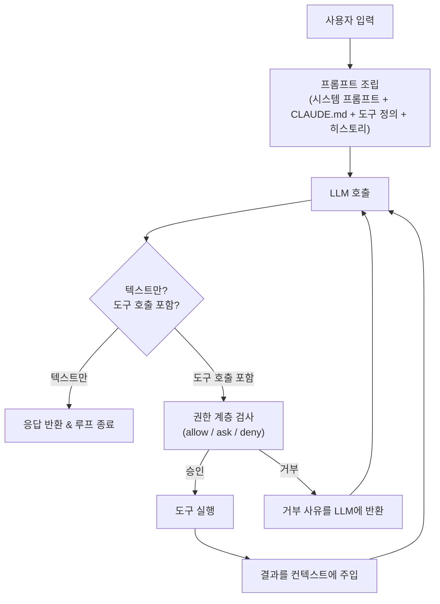
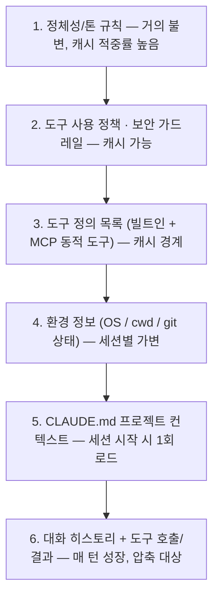
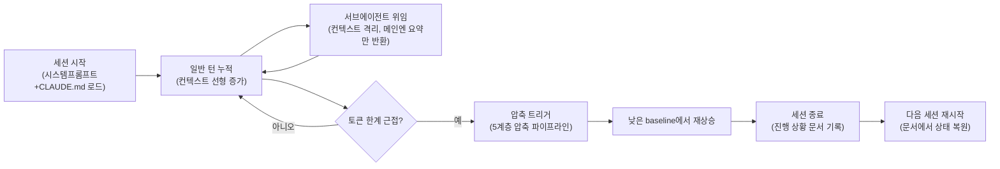

# [기술동향] LLM 에이전트의 "하네스(Harness)" — Claude Code를 중심으로

> 이 글은 비전문가도 읽을 수 있도록 비유를 먼저 들고, 그다음 기술적으로 부연하는 방식으로 썼습니다. 어려운 용어는 처음 나올 때 풀어서 설명합니다.

## 한 줄 요약 — 비유로 먼저

AI 모델(Claude 같은)은 **아주 똑똑한 요리사**입니다. 하지만 요리사 한 명이 아무리 뛰어나도 레스토랑이 저절로 돌아가진 않죠. 메뉴판, 주방 동선, 재료 재고 관리, 위생 수칙, 인수인계 노트 같은 **"운영 시스템"**이 있어야 매번 같은 품질의 요리가 나옵니다.

**하네스(harness)**란 바로 이 "운영 시스템"에 해당합니다. AI 모델이라는 두뇌를 감싸서 — 어떤 도구(파일 읽기, 코드 수정, 웹 검색 등)를 언제 어떻게 쓸지, 위험한 행동은 막을지, 예전에 하던 일을 어떻게 기억할지 — 를 관장하는 소프트웨어 계층입니다.

놀라운 점은, Claude Code(AI 코딩 도구)의 실제 코드를 뜯어본 연구에 따르면 **전체 코드 중 AI가 직접 판단하는 부분은 겨우 1.6%뿐이고, 나머지 98.4%는 이런 '운영 시스템' 코드**였다고 합니다. 즉 AI 코딩 도구를 잘 만드는 일의 대부분은 "AI를 똑똑하게 만드는 것"이 아니라 "그 AI를 둘러싼 안전하고 믿을 만한 작업 환경을 만드는 것"이라는 뜻입니다.

## 하네스의 핵심 구성요소 — 이해를 돕는 비유

| 구성요소 | 비유로 말하면 | 실제로 하는 일 |
|---|---|---|
| **시스템 프롬프트** | 신입사원에게 주는 "직원 매뉴얼" | AI에게 "너는 이런 성격, 이런 규칙으로 일해"라고 알려주는 지침서. 자주 안 바뀌는 부분과 자주 바뀌는 부분을 나눠 캐싱(반복 재사용)해서 속도를 높임 |
| **도구(함수) 인터페이스** | 요리사에게 쥐여주는 "잘 정리된 조리도구 세트" | AI가 실제로 파일을 읽고, 코드를 고치고, 검색하는 등 "행동"할 수 있게 해주는 인터페이스. 도구가 뒤죽박죽이면 AI도 헷갈림 |
| **컨텍스트(작업기억) 관리** | 회의가 길어지면 중간중간 "요약 정리"를 해주는 서기 | 대화가 길어지면 AI가 기억할 수 있는 용량(컨텍스트 윈도우)이 꽉 차기 전에 지금까지 내용을 요약해서 정리 |
| **메모리 시스템** | 매일 쓰는 업무 일지 | 오늘 대화 내용(단기 기억)과, 프로젝트에 대해 계속 알아야 할 내용(장기 기억, 예: CLAUDE.md 파일)을 구분해서 관리 |
| **권한/안전장치** | 신입사원이 회사 카드로 결제하기 전 상사 결재를 받는 절차 | 위험한 행동(예: 파일 강제 삭제)은 반드시 확인을 받게 하고, 안전한 행동은 바로 실행하게 함 |
| **서브에이전트(부하 직원)** | 본인이 직접 하지 않고 전문 팀원에게 맡기고 결과 보고만 받는 것 | 복잡한 하위 작업을 별도의 AI 인스턴스에 맡기고, 메인 작업에는 결과 요약만 돌려받아 정신없어지지 않게 함 |
| **훅(자동 규칙)** | "이 버튼을 누르면 무조건 이 절차를 따른다"는 자동화 규칙 | AI의 판단에 맡기지 않고, 특정 상황에서는 미리 정해진 스크립트가 무조건 실행되게 함 (안전판) |
| **에러 처리** | 고장 안내판에 "이렇게 고치세요"까지 써 있는 것 | 뭔가 실패했을 때 AI가 그냥 포기하지 않고, 다음에 뭘 시도해야 할지 알 수 있는 힌트를 함께 줌 |

## AI가 일하는 방식 — "에이전틱 루프"

사람이 일할 때를 생각해보면: **질문을 듣고 → 생각하고 → 행동하고(예: 자료를 찾아보고) → 결과를 보고 → 다시 생각하고...** 이런 식으로 반복하죠. AI 에이전트도 똑같습니다. 이 반복 과정을 **에이전틱 루프**라고 부릅니다.

**그림 읽는 법:** 맨 위 "사용자 입력"에서 시작해서, AI가 "이 요청을 처리하려면 도구를 써야 하나?"를 판단합니다. 도구가 필요 없으면(예: 그냥 질문에 답하면 되는 경우) 바로 답하고 끝. 도구가 필요하면(예: 파일을 읽어야 함) 먼저 "이거 해도 되는 행동인가?"를 확인(권한 검사)한 뒤 실행하고, 그 결과를 다시 AI에게 보여주고 처음부터 다시 생각하게 합니다. 이 화살표가 계속 도는 것이 "루프"입니다 — 사람이 결과를 보고 사전을 다시 찾아보듯이요.

## AI에게 주는 "직원 매뉴얼"은 어떻게 쌓여있나

AI에게 주는 지침(시스템 프롬프트)은 사실 한 장짜리 문서가 아니라 여러 겹으로 쌓인 문서 묶음입니다. **회사 규칙(거의 안 바뀜) → 부서 매뉴얼 → 오늘 프로젝트 정보 → 오늘 나눈 대화** 순으로, 아래로 갈수록 자주 바뀝니다.

**그림 읽는 법:** 위쪽 레이어(1~2번)는 "회사 규칙"처럼 거의 안 바뀌기 때문에, AI 시스템은 이 부분을 미리 계산해두고 재사용합니다(캐싱) — 이러면 매번 새로 계산할 필요가 없어서 빠르고 비용도 쌉니다. 아래쪽(5~6번)은 프로젝트마다, 대화마다 계속 바뀌는 부분입니다. Claude Code의 경우 이 전체 지침이 약 2,900토큰(단어보다 조금 작은 단위) 정도 되고, 여기에 사용 가능한 도구 목록과 프로젝트 설명 파일(CLAUDE.md)이 덧붙습니다.

## 대화가 길어지면? — "AI의 업무 일지"

AI가 기억할 수 있는 용량은 무한하지 않습니다. 대화가 길어지면 마치 사람이 회의를 오래 하면 앞부분을 까먹듯, AI도 컨텍스트(기억 공간)가 꽉 찹니다. 이때 두 가지 방법을 씁니다: **① 요약해서 압축**하거나, **② 아예 새로 시작하되 "인수인계 문서"를 남기는 것**입니다. 실제로 Anthropic(Claude를 만드는 회사)의 실험에 따르면, 아주 긴 작업에서는 그냥 요약하는 것보다 "깔끔하게 인수인계 문서를 남기고 새로 시작"하는 방식이 더 안정적인 결과를 냈다고 합니다 — 마치 담당자가 바뀔 때 구두로 대충 전달하는 것보다 인수인계 문서를 써서 넘기는 게 더 안전한 것과 같은 이치입니다.

**그림 읽는 법:** 왼쪽에서 시작해 오른쪽으로 시간이 흐릅니다. 대화가 계속되면 기억 공간 사용량이 점점 쌓이다가("일반 턴 누적"), 한계에 가까워지면 요약해서 정리("압축 트리거")하고 다시 낮은 상태에서 시작합니다. 세션(하나의 작업 단위)이 끝나면 "오늘 한 일" 문서를 남겨두고, 다음에 다시 시작할 때는 그 문서를 읽고 이어서 작업합니다 — 매번 처음부터 설명 안 해도 되게요.

## Claude Code만의 특징 (조금 더 깊이)

- **CLAUDE.md**: 프로젝트마다 두는 "이 프로젝트는 이런 규칙으로 일해주세요"라는 메모 파일. 작업을 시작할 때 자동으로 읽어들여 계속 참고함
- **부하 직원(서브에이전트)마다 다른 매뉴얼**: 탐색 담당, 계획 담당처럼 역할별로 서로 다른 지침을 가진 "전문 AI"를 따로 부림
- **위험도를 스스로 판단하는 보안 담당**: 기본적으로는 위험할 수 있는 행동마다 사람에게 물어보지만, "auto 모드"라는 기능은 별도의 작은 AI가 "이 행동이 진짜 위험한지"를 먼저 판단해서, 정말 위험한 것(예: 강제로 되돌릴 수 없는 삭제)만 걸러내고 나머지는 알아서 처리하게 함. 실험 결과 위험한 걸 위험하지 않다고 잘못 판단하는 비율은 0.4%, 안전한 걸 괜히 위험하다고 판단해 되묻는 비율은 17% 정도였다고 함
- **자동 요약 기능**: 대화가 길어지면 자동으로 정리해서 기억 공간을 관리

## 다른 AI 코딩 도구와 비교하면

Claude Code, OpenAI의 Codex CLI, Cursor, Devin 같은 AI 코딩 도구들은 모두 앞서 설명한 "질문→생각→행동→결과확인" 루프를 기본 골격으로 씁니다. 다만 성격이 조금씩 다릅니다.

- **Codex CLI**: "필요할 때마다 찾아보는" 스타일. 처음부터 계획을 크게 세우기보다, 일단 조금 읽어보고 고치고 테스트해보는 실용적인 방식. 대신 이전 대화를 잘 기억하지 못하는 편
- **Claude Code**: "먼저 계획부터 세우는" 스타일. 작업 시작 전에 프로젝트 전체를 먼저 훑어보고, 프로젝트 메모(CLAUDE.md)로 기억을 오래 유지하며, 위험한 행동 전에는 승인을 구하는 단계가 명확함
- **LangGraph, AutoGPT 같은 프레임워크**: 흐름을 개발자가 직접 코드로 미리 정해두는 경우가 많음 — "AI가 알아서 판단"하기보다 "정해진 순서대로 진행"하는 쪽에 더 가까움
- Devin, Cursor 등은 내부 구조가 공개되어 있지 않아 외부 분석에 의존해야 함(확실하지 않은 부분이 있을 수 있음)

## 핵심 원칙 한 줄 정리

- 도구는 사람이 일을 나누듯, AI도 작업을 자연스럽게 나눠 처리할 수 있게 설계해야 한다
- 도구가 주는 정보는 다다익선이 아니라 "지금 필요한 핵심 정보"여야 한다
- 뭔가 실패했을 때는 "에러가 났습니다"로 끝내지 말고 "이렇게 해보세요"까지 알려줘야 한다
- 미리 정해진 순서대로 도는 것은 "워크플로우", AI가 스스로 다음 행동을 결정하는 것은 "에이전트"다
- 오래 걸리는 작업일수록 "매번 새로 시작해도 이전 상황을 알 수 있게" 만드는 게 핵심 난제다

## 더 깊이 알고 싶다면 (참고자료)

**Anthropic 공식**
- [Building Effective AI Agents](https://www.anthropic.com/engineering/building-effective-agents) — 워크플로우 vs 에이전트, 에이전틱 시스템 설계 원칙의 출발점
- [Effective harnesses for long-running agents](https://www.anthropic.com/engineering/effective-harnesses-for-long-running-agents)
- [Harness design for long-running application development](https://www.anthropic.com/engineering/harness-design-long-running-apps)
- [Writing effective tools for AI agents—using AI agents](https://www.anthropic.com/engineering/writing-tools-for-agents)
- [How we built Claude Code auto mode](https://www.anthropic.com/engineering/claude-code-auto-mode) — 권한 시스템과 위험도 분류기 상세

**학술/커뮤니티 분석**
- [Dive into Claude Code: The Design Space of Today's and Future AI Agent Systems (arXiv 2604.14228)](https://arxiv.org/abs/2604.14228) — 코드베이스 정량 분석(1.6%/98.4% 통계, 5계층 압축 파이프라인, 권한 분류기 구조 등)의 원출처
- [VILA-Lab/Dive-into-Claude-Code (GitHub)](https://github.com/VILA-Lab/Dive-into-Claude-Code) — 위 논문의 동반 저장소
- [Piebald-AI/claude-code-system-prompts (GitHub)](https://github.com/Piebald-AI/claude-code-system-prompts) — 버전별 시스템 프롬프트/도구 설명 추적
- [Simon Willison — Highlights from the Claude 4 system prompt](https://simonwillison.net/2025/May/25/claude-4-system-prompt/) — 공식 공개 프롬프트 + 유출된 툴 설명까지 주석 정리
- [The Design Space of Coding Agent Harnesses (Codex CLI vs Claude Code)](https://codex.danielvaughan.com/2026/04/29/design-space-of-coding-agent-harnesses-codex-cli-claude-code-architectural-lessons/) — 두 하네스의 설계 철학 비교
- [Claude Code /compact 동작 분석](https://okhlopkov.com/claude-code-compaction-explained/)
- [awesome-harness-engineering (GitHub)](https://github.com/ai-boost/awesome-harness-engineering) — 하네스 엔지니어링 관련 툴/패턴/메모리/MCP/권한/관측성 정리 리스트

## 메모
- 알리바바 open-code-review 처럼 "에이전트 하이브리드(정확해야 하는 건 엔지니어링 로직, 판단은 에이전트)" 구조가 여러 사례에서 공통적으로 등장하는 패턴으로 보임 → 이후 기술동향에서 개별 사례 비교 예정
