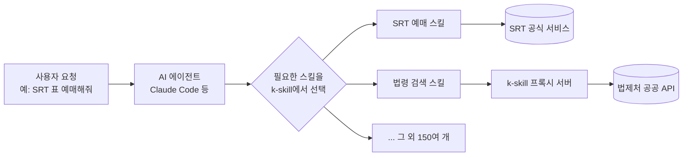

# [기술동향] k-skill 소개 — 한국형 서비스에 특화된 AI 에이전트 스킬 모음

> 이 글도 "이런 것도 있구나" 수준의 가벼운 소개입니다. 오픈소스 프로젝트 하나를 소개하고, 여기서 파생될 수 있는 활용 아이디어를 하나 얹었습니다 (아이디어 부분은 검증된 사실이 아니라 추정이라는 점을 명확히 표시했습니다).

## k-skill이 뭔가요

[k-skill](https://github.com/NomaDamas/k-skill)은 **Claude Code 같은 AI 에이전트가 한국 서비스를 다룰 수 있게 해주는 "스킬" 모음집**입니다. MIT 라이선스 오픈소스이고, 이 글 작성 시점 기준 약 6,300개 이상의 스타를 받은, 꽤 활발히 쓰이는 프로젝트입니다.

**비유로 말하면**: AI 에이전트는 기본적으로 영어권·글로벌 서비스에는 익숙해도, 한국 로컬 서비스(SRT 예매, 국세청 조회, 등기부등본 열람 등)는 "어떻게 접근해야 하는지" 모릅니다. k-skill은 스마트폰의 **앱스토어**처럼, 필요한 기능(스킬)을 하나씩 설치해서 AI 에이전트에게 "이제 이것도 할 수 있어"라고 붙여주는 역할을 합니다.

## 어떤 스킬들이 있나

150여 개의 스킬이 분야별로 정리되어 있습니다.

| 분야 | 예시 |
|---|---|
| 교통 | SRT/KTX 예매, 버스 조회 |
| 금융/세무 | 국세청 체납조회, 국민연금 조회, 주식 정보 |
| 부동산 | 등기부등본 열람, 경매 정보 |
| 쇼핑 | 쿠팡·다이소·올리브영 연동 |
| 법령/특허 | 법제처 법령 검색, KIPRIS 특허 검색 |
| 스포츠 | KBO·K리그·LCK 데이터 |
| 기타 | 맞춤법 검사 등 언어 도구 |

## 어떻게 동작하나

**그림 읽는 법:** 사용자가 요청을 하면, AI 에이전트가 k-skill 모음 중 적절한 스킬을 골라 실행합니다. 인증이 필요 없는 공공 API 계열은 k-skill이 직접 운영하는 프록시 서버를 거쳐 호출되고, 그 외에는 각 서비스에 바로 연결됩니다. 앞서 소개한 [MCP](2026-07-21-mcp와-업무자동화.md)로 다양한 도구를 연결하는 방식과 마찬가지로 "AI에게 새 능력을 붙여준다"는 개념은 동일합니다 — k-skill은 그중에서도 한국 로컬 서비스에 특화된 스킬 세트인 셈입니다.

## 활용 아이디어: 자동차 업무의 법규 검색에 써먹을 수 있을까?

k-skill에는 법제처 공식 Open API(open.law.go.kr)를 감싼 **법령 검색 스킬**이 있습니다. 현행 법령·판례·헌재결정·행정규칙·자치법규·조약을 검색어로 조회할 수 있습니다.

> ⚠️ **여기부터는 검증된 사실이 아니라 아이디어 수준의 추정입니다.** k-skill이 자동차 분야를 위해 설계된 기능은 아니며, 이 프로젝트 안에서 "자동차 법규에 활용 가능하다"는 분석이나 사례를 온라인에서 직접 확인하지는 못했습니다.

다만 기술적으로는 이런 확장이 개연성이 있어 보입니다: 법령 검색 스킬은 검색어 기반으로 동작하므로, 이론적으로는 "자동차관리법", "자동차 및 자동차부품의 성능과 기준에 관한 규칙" 같은 자동차 관련 법령·행정규칙도 검색 대상에 포함될 수 있습니다. 즉 자동차 업무를 하면서 관련 국내 법규를 빠르게 찾아보는 보조 도구로 응용해볼 여지는 있어 보입니다. 다만:

- 이 스킬은 범용 법령검색이라 **자동차 전문 기준(예: KATRI 자동차안전기준시스템, UNECE 국제기준 등)까지 다루지는 않을 가능성이 높습니다**
- 검색 정확도·최신성이 실제 업무에 쓸 만한 수준인지는 검증되지 않았습니다
- 실제 업무에 쓰기 전에는 검색 결과를 반드시 원문(법제처 등 공식 출처)과 대조해 확인이 필요합니다

**요약하면**: "법령 검색"이라는 범용 기능이 있으니 자동차 법규 쪽에도 응용해볼 수는 있겠다는 정도의 아이디어이지, k-skill이 자동차 업무용으로 검증된 도구라는 뜻은 아닙니다. 관심 있으면 한번 테스트해보고 결과를 공유하면 좋을 것 같습니다.

## 참고자료

- [k-skill (GitHub, NomaDamas)](https://github.com/NomaDamas/k-skill) — 저장소 본체
- [k-skill README](https://github.com/NomaDamas/k-skill/blob/main/README.md)
- [법령 검색 스킬 문서](https://github.com/NomaDamas/k-skill/blob/main/docs/features/korean-law-search.md)
- [스킬 소스 목록](https://github.com/NomaDamas/k-skill/blob/main/docs/sources.md)
- [NomaDamas](https://nomadamas.org/) — 메인테이너(오픈소스 AI 커뮤니티)

---
📎 더 많은 기술동향: https://github.com/21-Arbiter/Tech_Storage
