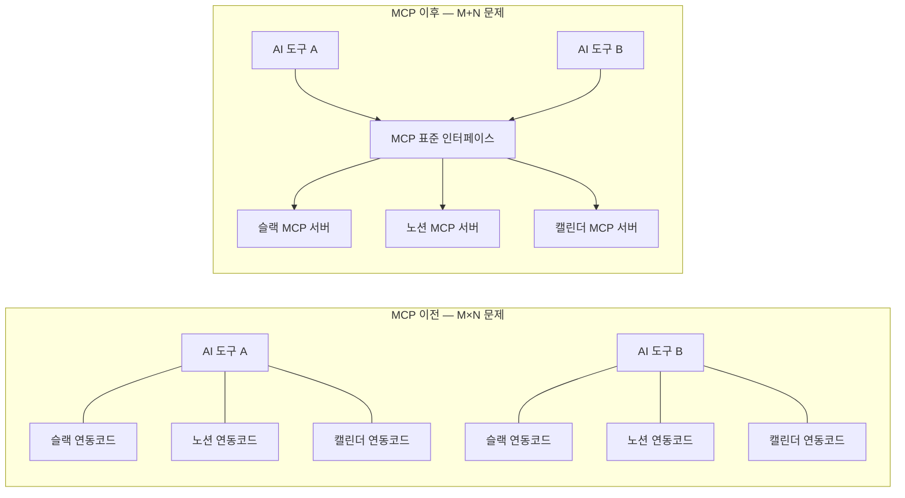
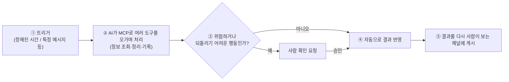
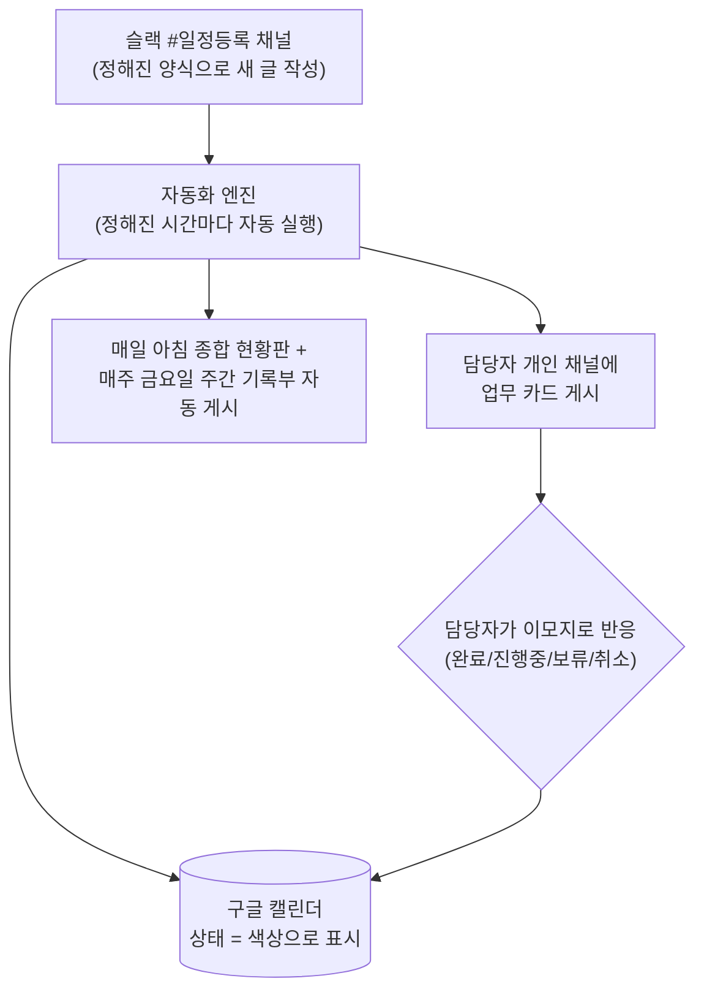

# [기술동향] MCP 소개와 업무 자동화 방법론

> 이 글은 깊게 파는 글이 아니라 "이런 기술도 있구나"를 목표로 하는 간단 소개 글입니다. MCP가 뭔지, 그걸로 실제 업무를 어떻게 자동화하는지 실제 사내 사례와 함께 가볍게 소개합니다.

## MCP란 무엇인가

**MCP(Model Context Protocol)**는 AI가 슬랙, 노션, 구글 캘린더 같은 외부 서비스와 대화할 수 있게 해주는 **공통 연결 규격**입니다. Anthropic이 2024년에 공개한 오픈소스 표준으로, 공식 문서는 이를 이렇게 비유합니다.

> "MCP를 AI 애플리케이션을 위한 USB-C 포트라고 생각하면 됩니다."

USB-C가 나오기 전에는 기기마다 다른 충전기 포트를 썼습니다. MCP 이전의 AI 도구 연동도 비슷했습니다 — AI 서비스마다, 연결하려는 외부 툴마다 매번 다른 연동 코드를 새로 짜야 했습니다. AI 서비스가 M개, 연결하려는 툴이 N개면 최악의 경우 **M×N개**의 커스텀 연동이 필요한 셈입니다. MCP는 양쪽이 "이 규격만 지키면 서로 통한다"는 공통 인터페이스를 정해서, 이론적으로는 **M+N개**의 연동만 있으면 되게 만듭니다. (이 M×N 비유는 MCP 생태계에서 자주 쓰이는 설명 방식입니다.)

**그림 읽는 법:** 왼쪽은 AI 도구마다 연결하려는 서비스마다 전용 코드를 따로 짜야 하는 상황입니다. 오른쪽은 모두가 같은 규격(MCP)을 따르기 때문에, 새 AI 도구가 생겨도 이미 있는 슬랙/노션/캘린더 연동을 그대로 재사용할 수 있고, 새 서비스가 생겨도 그 서비스용 MCP 하나만 만들면 모든 AI 도구가 바로 쓸 수 있습니다.

## 업무 자동화 방법론 — MCP로 무엇을 할 수 있나

MCP 자체는 "연결 규격"일 뿐이고, 실제로 업무를 자동화하려면 몇 가지 요소를 더 조합해야 합니다.

**그림 읽는 법:** 자동화는 보통 ① 정기적인 시간이나 특정 이벤트가 트리거가 되고, ② AI가 MCP로 슬랙·캘린더·문서 도구 등을 오가며 필요한 작업을 처리하고, ③ 되돌리기 어려운 행동(삭제 등)은 사람 확인을 거치게 하고, ④~⑤ 결과를 다시 사람이 보는 채널에 정리해서 올려주는 흐름입니다. 이 패턴 자체는 도구가 무엇이든 거의 똑같이 적용됩니다.

## 실전 사례: 팀 일정·업무 현황 자동화

이론만으로는 감이 잘 안 오니, 실제로 사내에서 이 방식으로 만든 자동화 사례를 소개합니다. 슬랙에 일정을 정해진 양식으로 올리면, AI가 자동으로 구글 캘린더에 등록하고 담당자에게 업무 카드를 전달하며, 담당자가 이모지 반응 한 번으로 진행 상태를 갱신하는 시스템입니다.

**그림 읽는 법:** 사람은 딱 두 가지만 합니다 — ① 정해진 양식으로 슬랙에 일정을 올리고, ② 담당 업무 카드에 이모지로 반응하는 것. 나머지(캘린더 등록, 담당자에게 알리기, 현황 정리, 주간 보고서 작성)는 전부 자동으로 처리됩니다. 특히 "취소"처럼 되돌리기 어려운 행동은 이모지 하나로 바로 실행되지 않고, AI가 "정말 삭제할까요?"라고 한 번 더 확인한 뒤 최종 승인 반응까지 받아야 실행되도록 안전장치를 뒀습니다 — 앞서 소개한 "위험한 행동은 사람 확인" 원칙이 그대로 적용된 예입니다.

## 왜 이런 방식이 좋은가 — 핵심 포인트

- **입력 지점을 하나로 모음**: 여러 도구에 각각 손으로 입력하지 않고, 익숙한 채팅창(슬랙)에 한 번만 올리면 나머지 도구까지 자동으로 반영됨
- **상태를 저마찰 인터페이스로 관리**: 새로 뭔가를 타이핑하지 않고 이모지 반응 하나로 상태가 바뀜 — 사람이 자동화를 계속 쓰게 만드는 데 중요한 부분
- **위험한 동작에는 확인 단계를 둠**: 삭제처럼 되돌리기 어려운 행동은 AI 판단에만 맡기지 않고 2단계 확인을 거치게 설계
- **정기 스케줄로 "누가 안 챙겨도 도는" 구조**: 담당자가 매일 안 챙겨도 아침 현황판, 주간 보고서가 알아서 올라옴
- **하나의 정답 저장소(단일 진실 공급원)**: 이 사례에서는 구글 캘린더가 "지금 상태가 뭔지"의 기준점 역할을 하고, 슬랙 카드·현황판은 모두 거기서 파생된 화면일 뿐

## 더 깊이 알고 싶다면 (참고자료)

- [Model Context Protocol 공식 소개](https://modelcontextprotocol.io/introduction) — MCP가 무엇인지, "USB-C for AI" 비유의 출처
- [Introducing the Model Context Protocol (Anthropic, 2024-11-25)](https://www.anthropic.com/news/model-context-protocol) — MCP 최초 발표 글
- [Schedule recurring tasks in Claude Cowork](https://support.claude.com/en/articles/13854387-schedule-recurring-tasks-in-claude-cowork) — 정기 스케줄 자동화 기능 공식 문서
- [Hugging Face MCP Course — Key Concepts](https://huggingface.co/learn/mcp-course/unit1/key-concepts) — M×N 문제 설명을 포함한 개념 정리

---
📎 더 많은 기술동향: https://github.com/21-Arbiter/Tech_Storage
