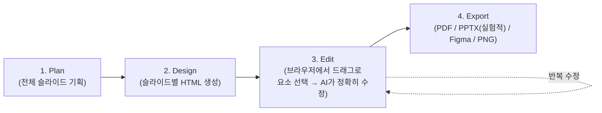

# [기술동향] slides-grab 소개 — AI 에이전트가 만드는 HTML 기반 슬라이드

> 이번에도 가벼운 소개 글입니다. 오픈소스 프로젝트가 뭘 하는지, 실제로 어떻게 쓰는지, 어디에 써먹을 수 있을지를 다룹니다.

## slides-grab이 뭔가요

[slides-grab](https://github.com/NomaDamas/slides-grab)은 Claude Code 같은 AI 에이전트가 **HTML/CSS 기반 슬라이드를 기획·디자인·편집·내보내기까지 처리**하도록 도와주는 오픈소스 도구입니다. k-skill과 같은 팀(NomaDamas, 서울 기반 오픈소스 커뮤니티)이 만들었고 MIT 라이선스이며, 약 1,100개 스타를 받은 활발한 프로젝트입니다.

**해결하려는 문제**: Gamma, Beautiful.ai 같은 기존 AI 슬라이드 도구는 처음 만들 때는 편하지만, "이 부분만 살짝 고쳐줘"라고 시키면 AI가 어느 부분을 말하는지 정확히 못 알아듣는 경우가 많습니다. 텍스트만으로 "왼쪽 위 그래프 옆에 있는 파란 박스"를 설명하는 건 생각보다 모호합니다.

**해결 방식**: slides-grab은 브라우저에서 **수정하고 싶은 요소를 마우스로 직접 드래그해서 박스로 선택**하고, 그 정확한 위치·범위 정보를 AI 에이전트에게 넘깁니다. 말로 설명하는 대신 "바로 이거"라고 짚어주는 셈입니다.

## 어떻게 동작하나



**그림 읽는 법:** 전체 구성을 기획하고, 슬라이드마다 HTML로 초안을 만든 다음, 편집 단계에서 마음에 안 드는 부분을 드래그로 짚어가며 여러 번 반복 수정하고, 마지막에 원하는 형식으로 내보냅니다. HTML 기반이라 Git으로 버전 관리도 가능하고, 95개의 번들 디자인 스타일이 있어 스타일 통일도 쉽습니다.

## 왜 "드래그로 짚기"가 다른가


## 실제로 어떻게 쓰나

```bash
# 설치
npm install slides-grab
npx playwright install chromium
npx slides-grab install-skills --target all --scope user

# 주요 명령
slides-grab edit              # 브라우저 편집기 실행
slides-grab pdf               # PDF로 내보내기
slides-grab convert           # PPTX로 변환 (실험적 기능)
slides-grab fetch-video --url <유튜브 URL>   # 영상 자료 가져오기
```

## 활용 아이디어

- **발표자료·보고서 제작**: 연구/과제 발표 자료를 만들 때, 회사·팀 표준 스타일을 템플릿으로 가져와(`import-template`) 여러 장을 통일된 톤으로 빠르게 생성
- **정밀 수정이 필요한 협업 자료**: "이 표만 다시 그려줘", "이 도형 위치만 옮겨줘"처럼 특정 요소를 정확히 짚어 고쳐야 하는 경우, 디자인 툴을 몰라도 마우스 드래그만으로 세밀한 수정 가능
- **버전 관리가 필요한 자료**: HTML/CSS 기반이라 슬라이드 자체를 Git으로 버전 관리할 수 있어, 여러 사람이 같이 다듬는 발표자료에 적합
- **카드뉴스·요약 이미지**: 1:1 비율 카드뉴스 포맷도 지원해서, 기술동향이나 연구 결과를 SNS·슬랙 공유용 이미지로 요약하는 데도 응용 가능

## 알아둘 점 (한계)

- PPTX 변환은 아직 **실험적 기능**으로, 안정성이 완전하지 않다는 커뮤니티 피드백이 있습니다
- Node.js 20 이상, Playwright(브라우저 자동화) 설치가 필요해 개발 환경 세팅이 어느 정도 필요합니다
- PDF/HTML 결과물 위주라, 이미 파워포인트 파일(.pptx) 협업이 표준인 조직에서는 최종 변환 단계에서 손이 더 갈 수 있습니다

## 참고자료

- [slides-grab (GitHub, NomaDamas)](https://github.com/NomaDamas/slides-grab) — 저장소 본체
- [slides-grab 소개 및 사용기 (한국어 블로그)](https://ideas.paasup.io/slides-grab/) — 실제 사용 경험과 한계 분석
- [NomaDamas](https://nomadamas.org/) — 메인테이너(오픈소스 AI 커뮤니티), [k-skill](2026-07-21-k-skill-소개.md)과 같은 팀

---
📎 더 많은 기술동향: https://github.com/21-Arbiter/Tech_Storage
