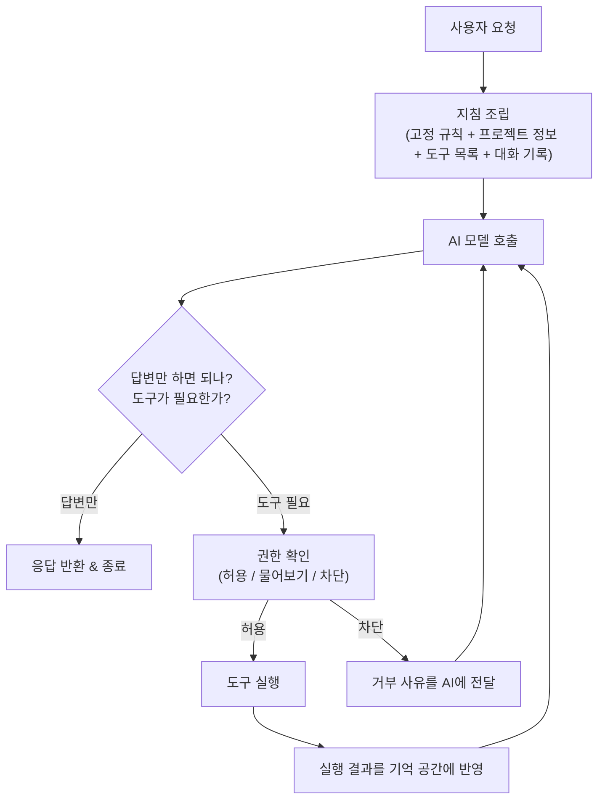
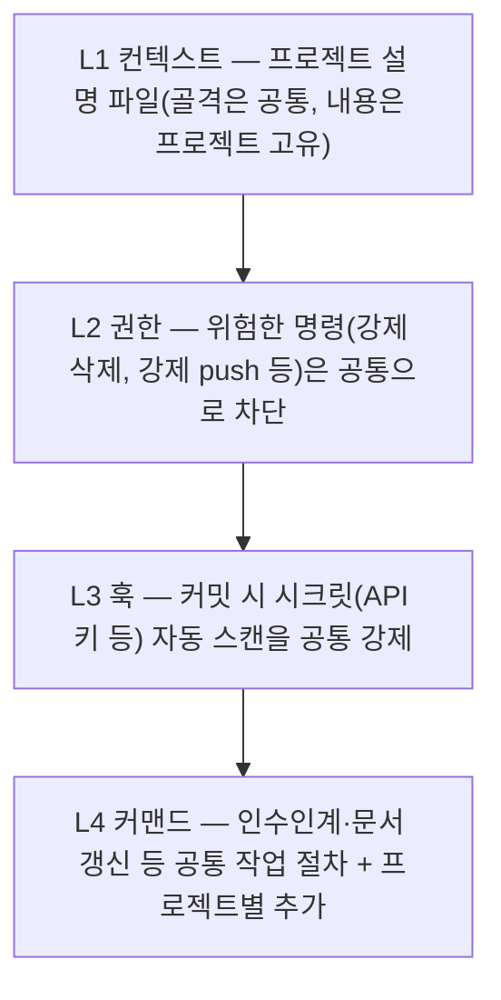
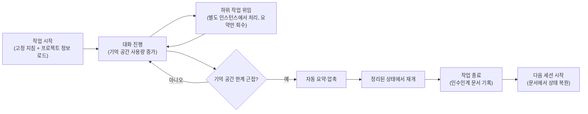

# [기술동향] 하네스 엔지니어링(Harness Engineering)이란 무엇인가

> 이 글은 특정 도구(Claude Code 등)를 설명하는 글이 아니라, AI 에이전트를 다룰 때 왜 "하네스"라는 개념이 필요한지, 그 원리는 무엇인지를 다룹니다. 비전문가도 읽을 수 있도록 비유를 먼저 들고 기술적으로 부연하는 방식으로 썼습니다.

## 왜 이 개념이 필요한가 — 문제 상황부터

AI(LLM, 거대언어모델)에게 그냥 "이 코드 고쳐줘"라고 시키면 어떤 일이 생길까요?

- 어떤 날은 잘 고치고, 어떤 날은 엉뚱한 파일을 건드립니다 (AI의 판단은 **매번 100% 똑같지 않습니다** — 확률적으로 답을 생성하기 때문)
- 대화가 길어지면 처음에 말한 내용을 까먹습니다 (AI가 한 번에 기억할 수 있는 용량은 정해져 있음)
- 위험한 행동(예: 파일 삭제, 강제 push)도 시키는 대로 다 해버릴 수 있습니다 (안전장치가 없으면)
- 어제 했던 작업을 오늘 또 처음부터 설명해줘야 합니다 (세션이 끝나면 기억이 리셋됨)
- 팀원마다 AI에게 다른 방식으로 일을 시켜서, 결과물의 품질과 스타일이 프로젝트마다 제각각입니다

**하네스 엔지니어링**은 이런 문제들을 "AI를 더 똑똑하게 만들어서" 푸는 게 아니라, **AI를 감싸는 소프트웨어 장치를 잘 설계해서** 푸는 접근입니다. AI 모델 자체는 그대로 두고, 그 주변 환경(무엇을 기억하게 할지, 무엇을 허락할지, 실패하면 어떻게 알려줄지)을 엔지니어링하는 것입니다.

## 비유로 먼저 이해하기

AI 모델은 **아주 똑똑하지만 방금 입사한 신입 요리사**와 같습니다. 요리 실력은 뛰어나지만 레스토랑 운영 규칙을 모르고, 매번 다른 컨디션으로 일합니다. 신입 요리사 한 명만으로는 레스토랑이 안정적으로 돌아가지 않습니다 — 메뉴판, 주방 동선, 재료 재고 관리, 위생 수칙, 인수인계 노트 같은 **"운영 시스템"**이 있어야 매번 같은 품질의 요리가 나옵니다.

**하네스(harness)**는 바로 이 "운영 시스템"입니다. AI라는 두뇌를 감싸서 — 어떤 도구(파일 읽기, 코드 수정, 검색 등)를 언제 쓸지, 위험한 행동은 막을지, 예전 작업 내용을 어떻게 기억할지 — 를 관장하는 소프트웨어 계층입니다. 이것이 "엔지니어링"인 이유는, 이 운영 시스템 자체는 AI의 확률적 판단에 맡기지 않고 **사람이 미리 정한 규칙과 코드로 결정론적으로** 동작하게 만들기 때문입니다.

실제로 어느 AI 코딩 도구(Claude Code)의 코드를 뜯어본 연구에 따르면, **전체 코드 중 AI가 직접 판단하는 부분은 겨우 1.6%뿐이고, 나머지 98.4%는 이런 '운영 시스템' 코드**였다고 합니다. AI 도구를 잘 만드는 일의 대부분은 "AI를 똑똑하게 만드는 것"이 아니라 "그 AI를 둘러싼 안전하고 예측 가능한 작업 환경을 만드는 것"이라는 뜻입니다.

## 하네스의 핵심 구성요소 — 어떤 문제를 어떻게 푸는가

| 구성요소 | 이게 없으면 생기는 문제 | 하네스가 하는 일 |
|---|---|---|
| **지침(시스템 프롬프트)** | AI가 매번 다른 성격·규칙으로 일함 | "너는 이런 원칙으로 일해"라는 지침을 표준화해서 매번 동일하게 제공 |
| **도구 인터페이스** | AI가 실제로 아무것도 "행동"할 수 없거나, 뒤죽박죽 도구로 헷갈림 | 파일 읽기·코드 수정·검색 등을 잘 정리된 인터페이스로 제공 |
| **기억 공간(컨텍스트) 관리** | 대화가 길어지면 앞부분을 통째로 잊어버림 | 한계에 도달하기 전에 자동으로 요약·정리 |
| **장단기 메모리** | 세션이 끝나면 모든 맥락이 사라져 매번 재설명 필요 | 프로젝트 고유 정보는 별도 파일로 영속 보관, 대화 내용은 세션 안에서만 유지 |
| **권한/안전장치** | 위험한 행동(강제 삭제, 강제 push 등)도 시키는 대로 실행 | 위험한 행동은 확인을 거치게 하고, 특정 행동은 아예 금지(deny) |
| **부하 작업 위임(서브에이전트)** | 복잡한 작업을 한 번에 다 처리하려다 정신없어짐(맥락 오염) | 하위 작업을 별도 인스턴스에 맡기고 요약 결과만 받아옴 |
| **자동 규칙(훅)** | 사람이 매번 챙기지 않으면 실수(예: 시크릿 커밋)가 발생 | 특정 상황에서 AI 판단과 무관하게 스크립트가 무조건 실행되게 함 |
| **에러 처리** | 실패하면 그냥 멈추거나 같은 실수를 반복 | 실패 원인과 다음에 시도할 방법까지 함께 알려줌 |

## AI가 일하는 방식 — 어느 도구든 공통인 "에이전틱 루프"

사람이 일할 때: **질문을 듣고 → 생각하고 → 행동하고(자료를 찾아보고) → 결과를 보고 → 다시 생각하고...** 이 반복을 AI 에이전트도 그대로 따라 합니다. 이것이 **에이전틱 루프**이며, 어떤 AI 코딩 도구든 대부분 이 골격을 공유합니다.

**그림 읽는 법:** 요청이 들어오면 AI가 "이걸 처리하려면 행동(도구 사용)이 필요한가?"를 판단합니다. 필요 없으면 바로 답하고 끝. 필요하면 먼저 "이거 해도 되는 행동인가?"를 확인(권한 검사)한 뒤 실행하고, 결과를 다시 AI에게 보여줘 처음부터 다시 판단하게 합니다. 이 흐름이 계속 도는 것이 "루프"입니다.

## 실전 사례: 왜 팀 단위로 하네스가 필요한가

이론이 아니라 실제로 겪는 문제를 봅시다. 팀원 여러 명이 각자 AI 코딩 도구를 쓰면 이런 일이 생깁니다.

- A는 위험한 명령(강제 push)을 막는 규칙을 걸어뒀지만, B는 안 걸어둬서 사고가 남
- 어떤 프로젝트는 AI가 시크릿(API 키 등)을 실수로 커밋해버림
- 새 프로젝트를 시작할 때마다 "AI에게 어떻게 일을 시킬지"를 처음부터 다시 설정함
- 작업 인수인계 시 AI에게 맥락을 전달할 표준 방법이 없어서 사람이 일일이 설명

이런 문제를 풀기 위해 실제로 사내에서도 "프로젝트 표준 하네스" 저장소를 만들어 쓰고 있습니다. 새 프로젝트를 만들 때 스크립트 한 번으로 아래 4개 레이어를 자동 적용하고, 하네스 자체도 버전 관리하며 여러 프로젝트에 갱신을 배포하는 구조입니다.

**그림 읽는 법:** 프로젝트마다 다시 만들지 않고, 공통으로 지켜야 할 규칙(권한 차단, 시크릿 스캔)은 "하네스"라는 하나의 표준 템플릿에 담아두고, 새 프로젝트를 시작할 때 그대로 복사해서 적용합니다. 하네스 자체가 개선되면 버전을 올리고, 이미 만들어진 프로젝트들에도 공통 레이어만 골라서 갱신할 수 있습니다 — 프로젝트 고유 내용은 건드리지 않고요. **이게 바로 하네스 엔지니어링이 "왜" 필요한지에 대한 가장 실질적인 답입니다**: AI를 안전하고 일관되게 쓰려면, 그 방법을 사람 기억이 아니라 코드와 템플릿으로 표준화해야 합니다.

## 대화가 길어지면? — 기억을 관리하는 법

AI가 기억할 수 있는 용량은 무한하지 않습니다. 대화가 길어지면 두 가지 방법을 씁니다: **① 요약해서 압축**하거나, **② 아예 새로 시작하되 "인수인계 문서"를 남기는 것**입니다. 아주 긴 작업에서는 그냥 요약하는 것보다 "인수인계 문서를 남기고 새로 시작"하는 방식이 더 안정적인 결과를 낸다는 연구 결과도 있습니다 — 담당자가 바뀔 때 구두로 대충 전달하는 것보다 문서로 남겨 넘기는 게 더 안전한 것과 같은 이치입니다.

## 여러 AI 코딩 도구는 이 개념을 어떻게 각자 구현했나

하네스 엔지니어링은 특정 회사·도구의 전유물이 아니라 **AI 에이전트를 다루는 모든 도구가 마주치는 공통 과제**입니다. 대표적인 구현 예시들을 비교하면:

- **Claude Code (Anthropic)**: 작업 전에 프로젝트 전체를 먼저 훑어보고, 프로젝트 메모 파일로 기억을 오래 유지하며, 위험한 행동 전 승인 단계가 명확한 "먼저 계획부터 세우는" 스타일
- **Codex CLI (OpenAI)**: 처음부터 크게 계획하기보다 일단 조금 읽어보고 고치고 테스트하는 실용적인 "필요할 때마다 찾아보는" 스타일. 세션 간 기억은 상대적으로 약함
- **LangGraph, AutoGPT 같은 프레임워크**: 개발자가 흐름을 코드로 미리 정해두는 경우가 많음 — AI가 알아서 판단하기보다 "정해진 순서대로 진행"하는 쪽에 가까움
- Devin, Cursor 등은 내부 구조가 공개되어 있지 않아 외부 분석에 의존해야 함(확실하지 않은 부분이 있을 수 있음)

즉, "에이전틱 루프를 돈다"는 뼈대는 같지만, **기억을 얼마나 오래/어떻게 유지할지, 위험한 행동을 어느 수준까지 자동으로 허용할지, 계획을 얼마나 미리 세울지**가 도구마다 다른 설계 선택입니다.

## 핵심 원칙 한 줄 정리

- 도구는 사람이 일을 나누듯, AI도 작업을 자연스럽게 나눠 처리할 수 있게 설계해야 한다
- 도구가 주는 정보는 다다익선이 아니라 "지금 필요한 핵심 정보"여야 한다
- 뭔가 실패했을 때는 "에러가 났습니다"로 끝내지 말고 "이렇게 해보세요"까지 알려줘야 한다
- 미리 정해진 순서대로 도는 것은 "워크플로우", AI가 스스로 다음 행동을 결정하는 것은 "에이전트"다
- 오래 걸리는 작업일수록, 또 여러 사람이 함께 쓸수록 "AI에게 일을 시키는 방법 자체"를 표준화해두는 게 핵심이다

## 더 깊이 알고 싶다면 (참고자료)

**하네스 설계 원칙 (Anthropic 공식 — Claude Code는 하나의 구현 사례로 참고)**
- [Building Effective AI Agents](https://www.anthropic.com/engineering/building-effective-agents) — 워크플로우 vs 에이전트, 에이전틱 시스템 설계 원칙의 출발점
- [Effective harnesses for long-running agents](https://www.anthropic.com/engineering/effective-harnesses-for-long-running-agents)
- [Harness design for long-running application development](https://www.anthropic.com/engineering/harness-design-long-running-apps)
- [Writing effective tools for AI agents—using AI agents](https://www.anthropic.com/engineering/writing-tools-for-agents)
- [How we built Claude Code auto mode](https://www.anthropic.com/engineering/claude-code-auto-mode) — 권한 시스템과 위험도 분류기 상세

**학술/커뮤니티 분석**
- [Dive into Claude Code: The Design Space of Today's and Future AI Agent Systems (arXiv 2604.14228)](https://arxiv.org/abs/2604.14228) — 코드베이스 정량 분석(1.6%/98.4% 통계 등)의 원출처
- [VILA-Lab/Dive-into-Claude-Code (GitHub)](https://github.com/VILA-Lab/Dive-into-Claude-Code) — 위 논문의 동반 저장소
- [The Design Space of Coding Agent Harnesses (Codex CLI vs Claude Code)](https://codex.danielvaughan.com/2026/04/29/design-space-of-coding-agent-harnesses-codex-cli-claude-code-architectural-lessons/) — 서로 다른 두 하네스의 설계 철학 비교
- [awesome-harness-engineering (GitHub)](https://github.com/ai-boost/awesome-harness-engineering) — 하네스 엔지니어링 관련 툴/패턴/메모리/권한/관측성 정리 리스트

## 메모
- 알리바바 open-code-review 처럼 "에이전트 하이브리드(정확해야 하는 건 엔지니어링 로직, 판단은 에이전트)" 구조가 여러 사례에서 공통적으로 등장하는 패턴으로 보임 → 이후 기술동향에서 개별 사례 비교 예정

---
📎 더 많은 기술동향: https://github.com/21-Arbiter/Tech_Storage
